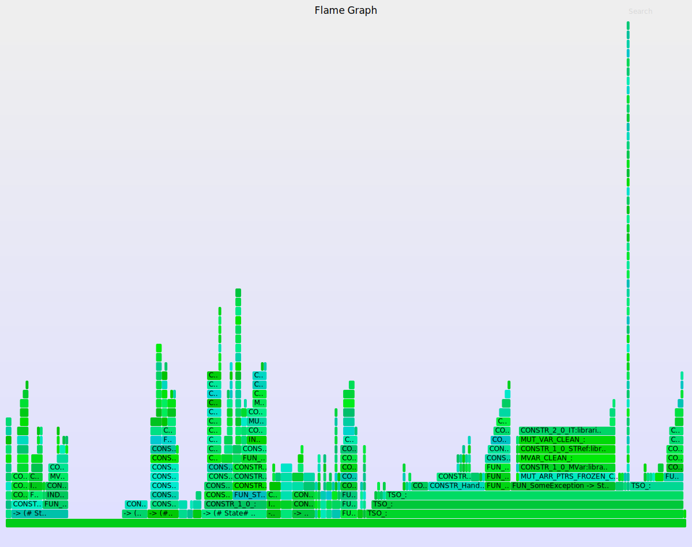

# Visualization Libraries for ghc-debug

This page serves as a conclusion to my Google Summer of Code project this past summer.

I had great fun this summer working on ghc-debug. Thank you so much to the community at `#ghc` on IRC for being so welcoming to me, and to Matthew Pickering for mentoring me.

### Google Summer of Code Project Link
https://summerofcode.withgoogle.com/projects/#6368742172262400

## Completed Work

- Added support for exporting the resulting graph from the
TypePointsFrom analysis to the GML graph visualization format: [ghc-debug merge request #3](https://gitlab.haskell.org/ghc/ghc-debug/-/merge_requests/3)

- Fixed a Hadrian (GHC build system) bug that prevented a GHC with
ghc-debug support being built on Darwin: [GHC merge request #6082](https://gitlab.haskell.org/ghc/ghc/-/merge_requests/6082)

- Added convenience functions for converting a generalized
census data type to Vega-Lite visualizations:
[ghc-debug merge request #4](https://gitlab.haskell.org/ghc/ghc-debug/-/merge_requests/4)

    - Converts a single census into a bar chart
    - Converts a series of censuses into a stacked area chart

- Support for outputing root traces as flamegraphs: [ghc-debug merge request #4](https://gitlab.haskell.org/ghc/ghc-debug/-/merge_requests/4), under `FlameGraph.hs`

- Attempted converting existing memory leak
detection methods from
[BLeak](https://cacm.acm.org/magazines/2020/11/248223-bleak/fulltext): [ghc-debug merge request #5](https://gitlab.haskell.org/ghc/ghc-debug/-/merge_requests/5)

    - Created functions to calculate total transitive closure size
    - Uses total number of closures transitively pointed to, to determine leaks
    - Characterizes leaks caused by lazy evaluation as long lists of the
    same kind of thunks


## Examples and Pretty Pictures!
The following visualizations are all from analyzing the following classic Haskell space leak, using my newly created library functions.

The value of the lazy MVar is not evaluated until it has to be printed, causing a leak in the form of a linked list of thunks.

```haskell
main :: IO ()
main = withGhcDebug $ do
    mvar <- newMVar (1 :: Int)
    replicateM_ 50 $ modifyMVar_ mvar (\x -> return (x+1))
    putStrLn "Hit Enter to continue...\n"
    _ <- getLine

    replicateM_ 100 $ modifyMVar_ mvar (\x -> return (x+1))
    putStrLn "Hit Enter to continue..."
    _ <- getLine

    replicateM_ 150 $ modifyMVar_ mvar (\x -> return (x+1))
    putStrLn "Hit Enter to continue..."
    _ <- getLine

    -- Prevent GC by using the MVar
    val <- takeMVar mvar
    putStrLn . show $ val
```




TODO: Figure out how to embed the Vega-Lite charts like in https://mpickering.github.io/eventlog2html/


[Census of Closure Types over Time (Stacked Area Chart)](../images/ghc-debug/lazy-thunk-stacked-area.html)

[Census of Closure Types](../images/ghc-debug/lazy-thunk-closure-census.html)

## TODO
- Adapt more of existing analysis functions to output to the generalized census type

- Continue experimenting with BLeak, to find the characterization that describes a memory
leak the best. Current linked list characterization is not sufficient.